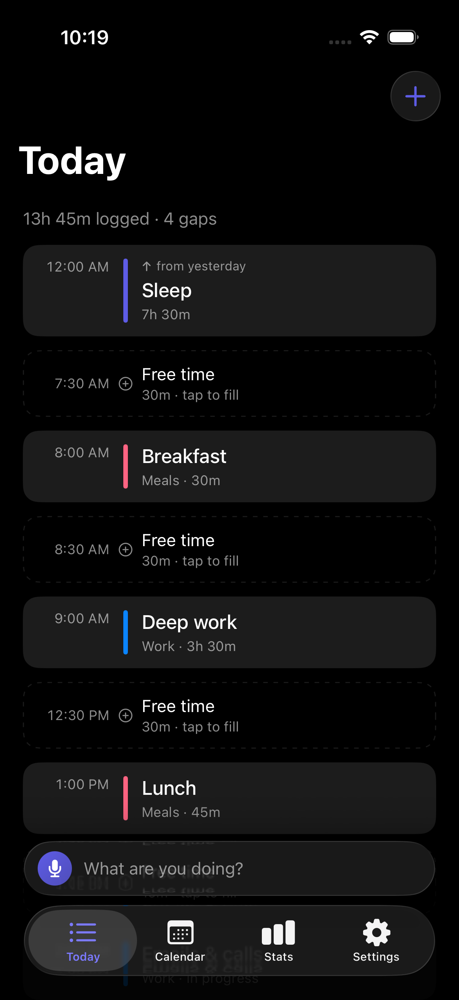
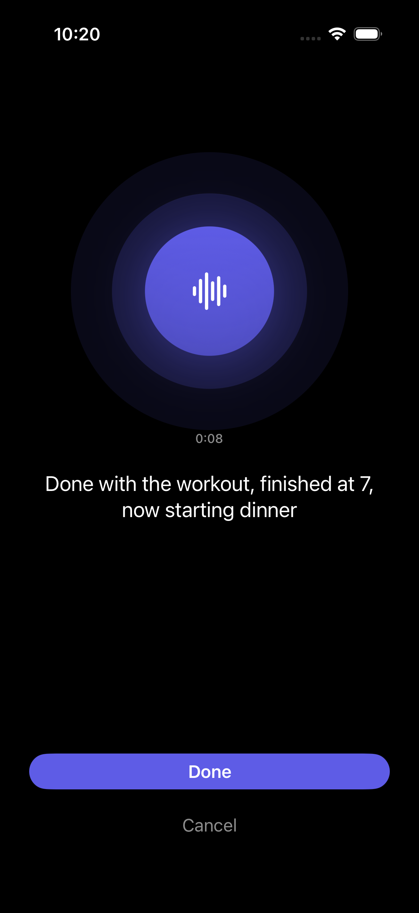
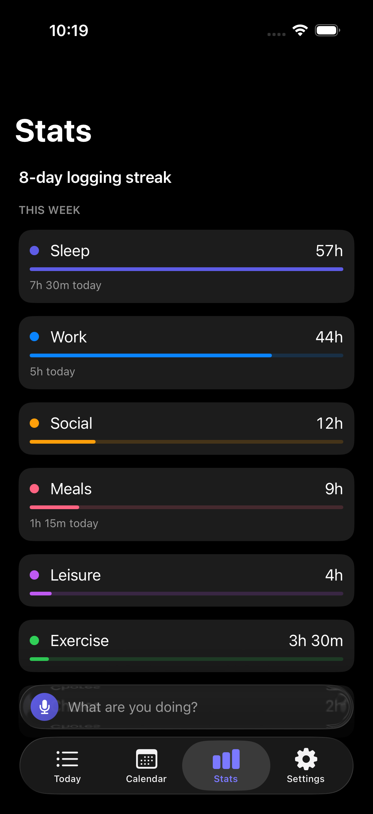
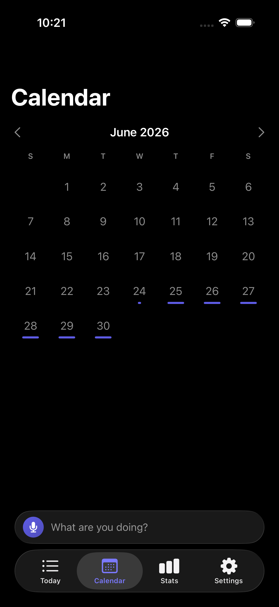
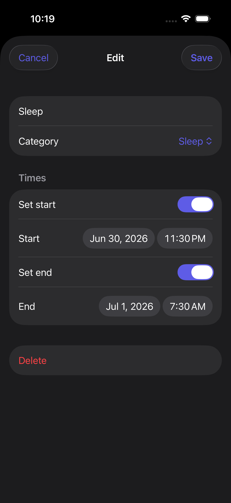
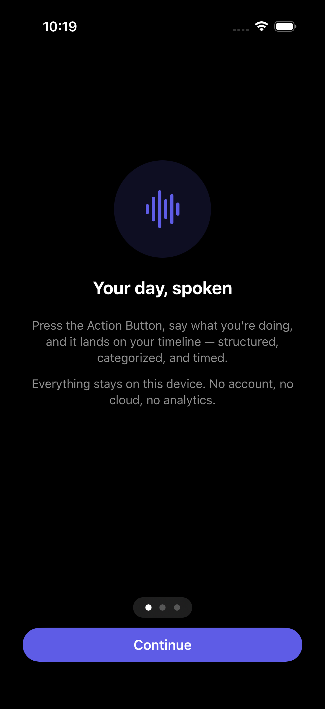

# Life Tracker

**A voice-first personal timeline for iPhone — press the Action Button, say what you're doing, and your day structures itself. Entirely on-device.**


<p align="center">
  
  
  
</p>
<p align="center">
  
  
  
</p>

## What it does

Say *"Class from 3:30 to 5:30, then I'll hit the gym"* — the timeline shows a pinned class block and a loose planned gym block after it. Later say *"done lifting, finished at 7, now dinner"* — the gym block confirms and closes at 7:00, dinner opens, and the gaps recompute. Every check-in is undoable as a unit.

- **One-press voice capture** — Action Button → App Intent → auto-recording, with live on-device transcription (SpeechAnalyzer) and a typed fallback.
- **Multi-activity understanding** — *"had breakfast at 8, then worked out, then showered"* becomes three contiguous blocks chained in order, not three guesses piled at "now".
- **Reconciliation, not just logging** — "just woke up" closes the overnight sleep block back to bedtime; "since 2pm" backfills a start; "actually class was 4 to 6" retimes; "skipped the run" removes the plan.
- **A post-capture receipt** — every check-in shows exactly which blocks it created or changed, with one-tap **Undo**.
- **Dynamic categories** — say *"went swimming"* once and a `swimming` category exists forever, de-duplicated against near-misses ("workout" / "working out" / "gym"), manageable (rename / recolor / merge / archive) from Settings.
- **Timeline as the hero** — confirmed blocks solid, planned blocks dashed, gaps rendered as tappable to-dos, inferred times marked with `≈`.
- **Calendar, stats, streaks** — month view with per-day fill, time per category for today/this week. Describe, don't grade.
- **Reminders & backup** — an inactivity nudge (local notifications, never overnight), and one-tap SQLite export / restore via the share sheet.

## Why it's interesting (engineering)

### The hybrid parser contract: the model proposes, deterministic code disposes

On-device LLMs (Apple FoundationModels, ~3B params, 4k context) are good at *reading* speech and terrible at clock math and stateful edits. So the model is only allowed to do the first part:

- **`FoundationModelsParser`** (guided generation with `@Generable` enums, few-shot instructions, greedy sampling) turns one utterance into *stated structure only*: activities, categories, times **as spoken** ("3:30", "an hour ago"), temporal state (completed / in progress / planned), and correction anchors. It never sees the database and never computes a date.
- **`TimelineService`** (plain, fully unit-tested Swift) does everything precise: resolves stated clock times against an injected `now` + IANA timezone (with AM/PM disambiguation biased toward waking hours), matches "done with X" to the actual open or planned block by normalized title, lays multi-activity check-ins out as a **sequential chain** (stated times → stated durations → "where the timeline left off" → even split), closes/retimes/backfills/skips, recomputes gaps, and writes an `event_revisions` row per change grouped by `batch_id` — which is what makes whole-check-in undo trivial.

The result: parsing failures degrade gracefully (the raw transcript is always persisted and re-parseable), and the part of the system that mutates your data is deterministic and covered by 82 headless tests.

### On-device pipeline

```
Action Button ──► App Intent (.foreground(.immediate)) ──► Capture view (auto-records)
                                                                │
                              SpeechAnalyzer / SpeechTranscriber (live, on-device)
                                                                │ raw transcript — ALWAYS persisted
                                                                ▼
                    FoundationModels @Generable parser → ParsedCheckIn (structure only)
                                                                │
                                                                ▼
        TimelineService — resolve times vs now+tz · match/open/close/retime/skip/backfill
                          · chain multi-activity check-ins · revisions grouped by batch_id
                                                                │
                                                                ▼
                        GRDB (SQLite) ──► Today · Calendar · Stats · Export
```

If Apple Intelligence is unavailable (ineligible device, feature off, model not ready), capture and transcription still work — check-ins land in an **Unsorted** inbox for manual structuring or later re-parse. Nothing core depends on the model succeeding.

### Architecture

Two layers, separated by protocols:

- **`LifeTrackerCore`** — a platform-agnostic Swift package (Foundation + GRDB only): schema/migrations, repositories, `TimelineService` (reconciliation), `EditService` (manual edits + undo + category merge), `GapCalculator`, `TimeResolver`, category normalization, and `CaptureService`. Runs headlessly: `swift test`.
- **`LifeTracker`** — the SwiftUI app: screens, App Intent, and the on-device implementations of Core's `Transcriber` / `TranscriptParser` protocols. A cloud STT/parser or a sync backend could drop in without touching feature code.

Sync-readiness is designed in, not bolted on: UUID text keys, `created_at`/`updated_at` in epoch-ms UTC, soft deletes everywhere (tombstones), per-check-in IANA timezone, `source`/`source_ref` idempotency for future imports.

## Privacy

Everything stays on the device. No backend, no accounts, no analytics, no network calls. Raw audio is never stored; the transcript is (so any check-in can be re-parsed as the prompt improves). Export produces a single SQLite file that you own.

## Requirements

- iPhone 15 Pro or later (A17 Pro+) with **Apple Intelligence enabled**, iOS 26+.
- A Mac with **Xcode 26+** to build. No paid developer account needed — the app uses zero paid entitlements.

## Build & run

The Xcode project is generated with [XcodeGen](https://github.com/yonaskolb/XcodeGen) from `project.yml`:

```sh
brew install xcodegen          # once
xcodegen generate              # creates LifeTracker.xcodeproj
open LifeTracker.xcodeproj     # select your personal team, then Run on your iPhone
```

Free signing notes: free-provisioned apps expire after 7 days (reconnect and rebuild to refresh — data persists). The Action Button, microphone, and the on-device model only work on a physical device, not the Simulator.

## Testing

| Layer | How |
|---|---|
| Core engine (reconciliation, time resolution, gaps, undo, repositories) | `cd LifeTrackerCore && swift test` — 82 headless tests |
| UI / navigation | iOS Simulator; `-seedDemo` launches an in-memory DB with a believable week |
| Speech + parsing quality | Physical device only; `ParserEval` runs a labeled transcript corpus against the live parser and scores segmentation/state/anchor accuracy, so prompt changes are measurable |

Screenshots in this README are reproducible: build for the Simulator and launch with `-seedDemo` (plus `-showCapture -fakeListening`, `-showCalendar -previousMonth`, `-showStats`, `-presentEdit`, or `-showOnboarding`).

## Roadmap

Tables already exist for the deferred features, so they're additive: goals & progress, a morning-intent / evening-review coaching loop, HealthKit workout auto-import (requires the paid Apple Developer Program), and optional cloud sync for sharing with friends.
